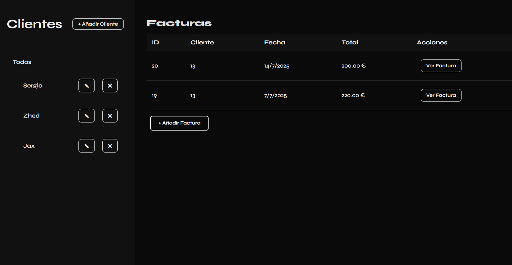

# React Node Invoice



> Aplicación completa de gestión de facturas, con frontend en React y backend en Express, utilizando MySQL como base de datos.  
> Permite crear, visualizar y gestionar clientes, facturas e ítems asociados mediante una interfaz moderna y una arquitectura robusta.

---

## Tecnologías

- **Frontend:** React, React Router, Fetch API, CSS Modules  
- **Backend:** Node.js, Express, MySQL, dotenv, cors  
- **Base de datos:** MySQL  
- **Control de versiones:** Git y GitHub

---

## Características

- Gestión completa de clientes (alta, baja, modificación, vista en modal)
- Registro de facturas con múltiples ítems por factura
- Visualización detallada de facturas (cliente, fecha, ítems, total)
- Cálculo automático del total de cada factura
- Interfaz sobria, clara y funcional con modales reutilizables
- Validación de datos en frontend y backend
- Arquitectura modular y escalable

---

## Requisitos previos

- Node.js (v14 o superior)  
- MySQL instalado y corriendo  
- Cuenta de GitHub para clonar el repositorio

---

## Instalación y ejecución

### 1. Clonar el repositorio

```bash
git clone https://github.com/tu-usuario/react-node-invoice.git
cd react-node-invoice

2. Configurar el backend

cd backend
npm install
Crea un archivo .env con tus variables de entorno:

DB_HOST=localhost
DB_USER=tu_usuario
DB_PASSWORD=tu_password
DB_NAME=nombre_base_de_datos
PORT=4000

3. Configurar el frontend

cd ../frontend
npm install
Asegúrate de que las llamadas fetch en React apunten a tu backend (http://localhost:4000/api).

4. Ejecutar la aplicación

En terminal 1 (backend):

cd backend
npm start
En terminal 2 (frontend):

cd frontend
npm start
Accede a la app desde tu navegador en:
http://localhost:3000

Despliegue
Frontend: Puede desplegarse fácilmente en Netlify, Vercel u otro proveedor estático.
Genera el build con: npm run build.

Backend: Compatible con Render, Railway o cualquier servicio que soporte Node.js y una base de datos MySQL.

Estructura del proyecto
bash
Copiar
Editar
react-node-invoice/
├── backend/            # Backend Express
│   ├── controllers/    # Lógica del negocio (clientes, facturas, ítems)
│   ├── routes/         # Definición de rutas API REST
│   ├── config/         # Configuración de base de datos
│   ├── index.js        # Servidor principal
│   └── .env            # Variables de entorno
├── frontend/           # Frontend React
│   ├── src/
│   │   ├── components/ # Componentes reutilizables
│   │   ├── App.js      # Aplicación principal
│   │   └── ...
│   └── public/
├── .gitignore
└── README.md
Retos técnicos del proyecto
Integración completa entre frontend y backend con estructuras de datos anidadas

Manejo de relaciones SQL (clientes → facturas → ítems) con claves foráneas

Cálculo dinámico del total de facturas con actualización de base de datos

Validación robusta y bidireccional de formularios (React y Express)

Manejo de múltiples modales sincronizados con el estado global

Organización modular del backend para mantener escalabilidad y legibilidad

Autor
Sergio Godoy
Email: sgdivergente13@gmail.com
GitHub: github.com/Blxzz-code

